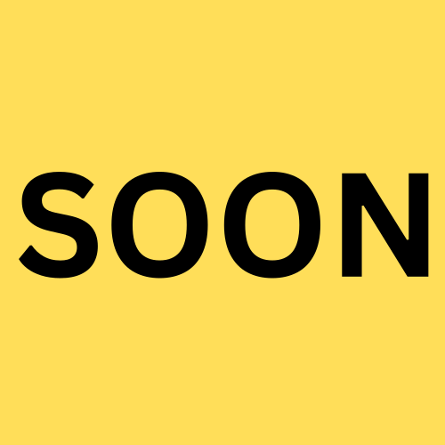
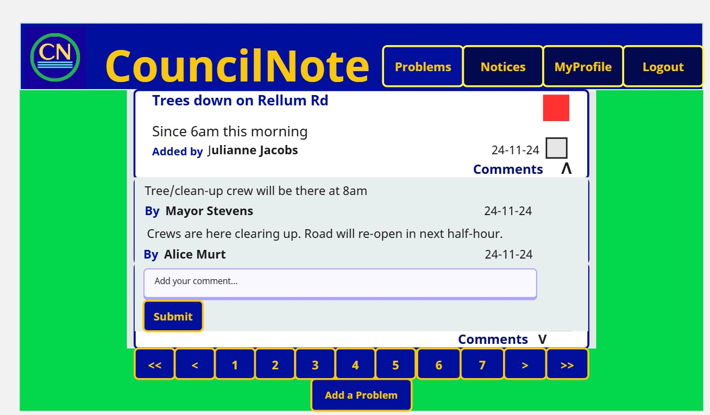
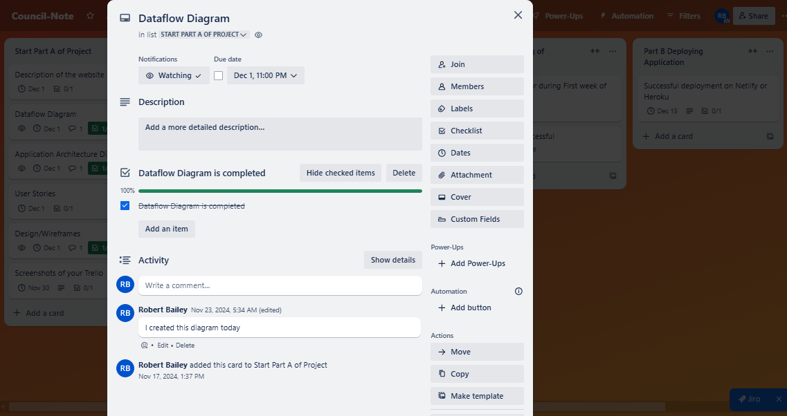
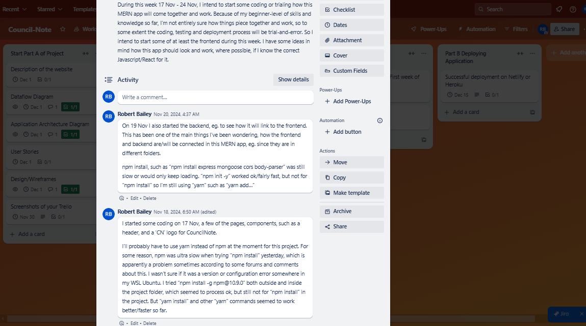

# Council-Note-PartA

## Description

### Purpose

### Functionality and features

Below are some examples of the Urgent and Soon symbols I intend to try out and implement during development of this app, whichever looks and works the best on the Problem posts.

#### Yellow Square symbol

#### Red Square symbol

#### Red Dot symbol

#### Yellow Dot SOON symbol

#### Yellow Square SOON symbol

#### Red Dot URGENT symbol

#### Red Square URGENT symbol

### Target audience

### Tech stack

## Dataflow Diagram

When drawing up this dataflow diagram, I endeavoured to follow the conventions of dataflow diagrams, mainly Yourdon and Coad, along with my ideas and understanding of the app structure so far.

## Application Architecture Diagram

## User Stories

## Wireframes

I have drawn up the wireframes in this Miro board, to the best of my understanding of React Bootstrap so far, and how the app will piece together accordingly:

https://miro.com/app/board/uXjVLAhsPcw=/

#### Mobile: Login, Create Account, Problems

#### Mobile: Nav Hamburger, Problem Form, Notices

#### Mobile: View UserProfile, Notice Form, Notices Comments

#### Tablet Login

#### Tablet Problems

#### Tablet Notices

#### Desktop Login

#### Desktop MyProfile

#### Desktop Problems page with comments

#### Desktop Problems Form

#### Desktop Problems page

## Screenshots of Trello board

I have used Trello to plan and keep track of the stages of development of this app in the coming weeks, such as when certain stages should be achieved and completed by.

#### Trello Overall

#### Trello Dataflow Diagram

#### Trello Application Architecture Diagram

#### Trello Wireframes

#### Trello Starting Coding

During the week of 17 Nov to 24 Nov 2024, I started some coding, at least trialling, of the frontend and backend to see how this MERN app will piece together and work, and to have some ideas for the Dataflow Diagram, Application Architecture Diagram and Wireframes.

#### Trello Successful Deployment

